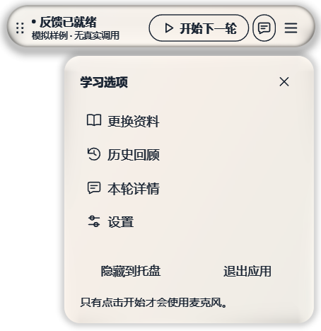
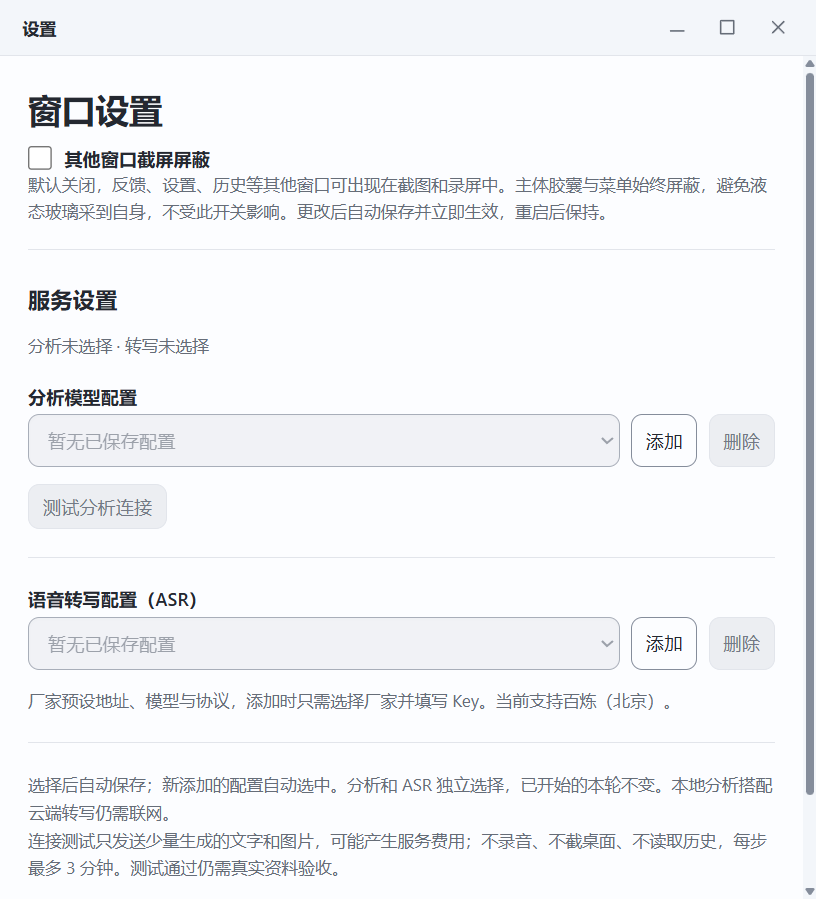
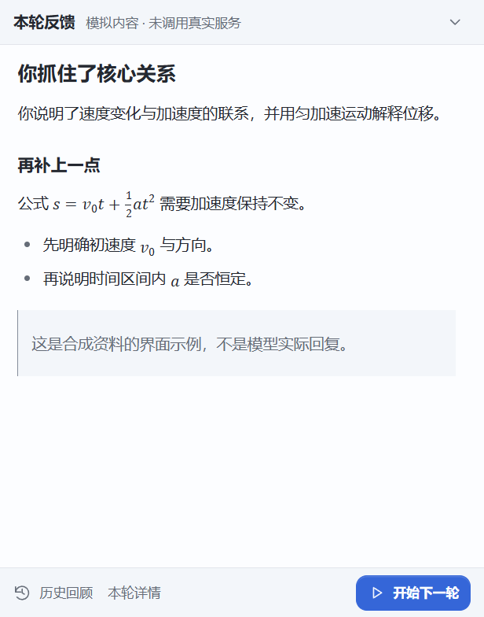
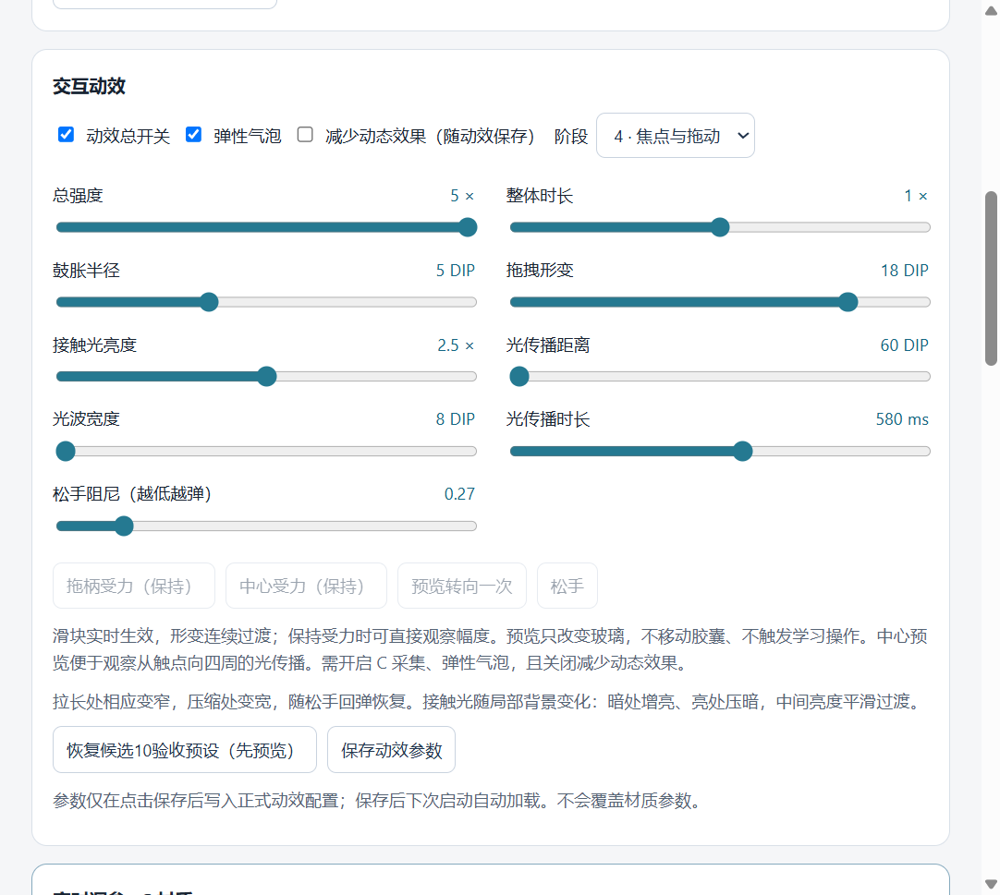

# LearningWithYou App · 自我解释学习助手

一个在 Windows 本机运行的 Electron 桌面应用：选择正在阅读的文档窗口，用自己的话解释，点击“结束并检查”，AI 根据开始截图、结束截图和最终语音转写给出简短反馈。通过解释发现理解中的遗漏，再继续下一段。

本仓库从主项目的 **0.16.4 实际工作区**独立整理，包含当时未提交的配置列表和窗口交互代码。原项目最近人工验收版本是 T15 / 0.15.10；此独立工程仍待人工验收。拆分没有更换 UI、提示词或模型策略。详见 [验证状态](docs/VALIDATION.md) 和 [来源说明](docs/PROVENANCE.md)。

## 界面

以下是独立 Windows 包的真实界面截图；内容由测试生成，不是用户资料或真实模型反馈。






## 完成一轮学习

1. 启动 App，打开胶囊菜单中的“设置”，分别添加并选中分析配置、ASR 配置。
2. 从菜单“选择资料”选择要阅读的文档窗口。核对窗口名称，保持内容可见。选择资料不会自动录音或请求模型。
3. 点击胶囊“开始”，允许麦克风访问，再用自己的话解释资料。此时获取开始截图，并开始录音和云端语音转写。
4. 点击“结束并检查”：停止录音、获取结束截图、等待最终转写，然后请求分析。
5. 反馈就绪后主动打开查看。反馈支持 Markdown、表格及数学公式；“本轮详情”可核对两张截图、转写、录音和诊断信息。
6. 继续下一段会复用同一资料来源与唯一学习会话。也可以更换资料，或从托盘退出。隐藏窗口不等于停止正在进行的学习。

分析失败且材料完整时，可以“使用本次内容重试”；不会自动换模型、自动重试或切换演示。录音或 ASR 失败导致材料不完整时，需要重新解释。

## 主要功能

- 独立资料选择、截图、录音、流式转写、最终分析与连续学习。
- 分析和 ASR 配置分别管理列表、添加、选择、删除；系统加密保存与旧配置迁移。
- 通用 Chat Completions 兼容 API、本地分析服务和主动文字/图片连接测试。
- 本轮详情、本地历史、录音播放、截图查看、单条删除与确认全部清除。
- 液态玻璃胶囊和菜单、拖动及反馈动效；右键胶囊打开外观调参，材质和动效分别预览、保存、重启恢复。
- 普通页面最小化、最大化/还原、托盘、窗口捕获保护、媒体与 GPU 资源生命周期管理。

## 平台和环境

目前构建目标仅为 **Windows x64**。本次实际主机、检查结果和限制见 [验证记录](docs/VALIDATION.md)。Windows ARM64、macOS、Linux 均未验证，也没有对应打包脚本。多显示器、显卡、缩放和受保护文档的行为不能由一台机器的结果推及所有硬件。

从源码开发需要：

- Node.js **24.18.0**（项目约束为 24.x，最低 24.18.0）和 pnpm **11.19.0**；Git。
- Windows .NET Framework 4.x C# 编译器：默认 `%WINDIR%\Microsoft.NET\Framework64\v4.0.30319\csc.exe`，需可引用 `System.Web.Extensions.dll`。源码在 `desktop/native/source-catalog.cs`，构建自动编译 x64 辅助 EXE。无需 Visual Studio C++ 编译此 C# 工具；sharp 使用锁文件选定的 Windows 预编译原生包。
- 可工作的图形桌面及 WebGL2。界面字体为 Windows Segoe UI / 微软雅黑，MathML 使用 Cambria Math；这些是系统字体，不随源码重新分发。中文或公式缺字时检查系统字体组件。
- 首次安装需要联网下载 npm 依赖及 Electron。不要禁用依赖脚本；允许构建的包在 `pnpm-workspace.yaml` 中列明。

```powershell
node --version
npm install --global pnpm@11.19.0
pnpm install --frozen-lockfile
pnpm check
pnpm dev
```

`pnpm dev` 先构建再启动 Electron，无网页服务器、热更新服务或外部浏览器；修改后重新执行。`pnpm start` 启动已有 `dist`。开发默认使用兼容的真实 userData；如只想测试，请使用下面的隔离启动方式。

```powershell
pnpm build
# 在你选择的新目录隔离配置和历史；不要填真实用户数据目录
pnpm exec electron dist --user-data-dir="$env:TEMP\LearningWithYou-App-manual-check"
```

安装和启动都不会自动调用付费模型或开始录音。默认开启的玻璃背景采集只在本机渲染，详见下方数据流向。

## 生产构建和便携包

```powershell
pnpm build
pnpm package
pnpm test:package
pnpm test:windows
pnpm test:glass
pnpm test:appearance
```

`release/latest.json` 指向本次带时间戳的包。双击其中的 `LearningWithYou-App.exe`，必须保留整个便携目录。最终包包含 Electron、原生工具、sharp/ws、玻璃预设、渲染代码和第三方许可证；无需 Node、原项目或其依赖目录。当前不生成安装器、不签名、不自动更新；Windows 可能显示未签名应用提示。

所有自动检查使用合成内容、临时 userData 和本地 mock；不会调用真实模型或麦克风。窗口检查需要已登录且未锁屏的 Windows 桌面，会短暂显示测试窗口。GPU 检查用生成的像素和视频，不能替代真实屏幕捕获验收。

## 配置分析服务与 ASR

“设置”→分析栏“添加”：填写 API Base URL、实际视觉模型名和该服务 Key；无鉴权服务留空。保存后加入列表并选中；切换立即保存，删除后回到未选择，不自动选其他配置。新条目不继承其他条目的 Key。每栏最多 32 条，修改服务绑定时新增一条再删除旧条目。密钥不回显。

| 服务类型 | Base URL 填写示例 | 限制 |
|---|---|---|
| 云端兼容 API | 服务方提供的 HTTPS 前缀，例如 `https://api.openai.com/v1` | 必须支持 Chat Completions 中的两张图片及文字；账户、模型权限由服务方决定 |
| 原百炼分析 | `https://dashscope.aliyuncs.com/compatible-mode/v1` | 使用对应地域与权限的分析密钥；不自动作为新 ASR 条目的密钥 |
| Ollama | `http://localhost:11434/v1` | 用户自行安装、启动支持视觉的兼容服务；Key 可留空 |
| LM Studio | `http://localhost:1234/v1` | 填服务实际模型 ID，按服务设置决定鉴权 |
| 局域网或代理 | `http://192.168.1.10:8000/models/v1` | 用真实主机及路径替换示例；HTTP 内容和密钥没有 TLS 传输保护 |

地址只追加 `/chat/completions`，不会自动补 `/v1`；不要填完整端点、用户名密码、查询参数或片段。App 不下载、不启动模型，不推测模型视觉能力。默认自然语言请求使用 `model/messages/stream:false`，对明确识别的原百炼端点保留原适配。结构化 JSON 模式需要服务支持 JSON Schema；失败不会自动降级。单步请求最多 180 秒。

“测试分析连接”测试已保存的选中条目；添加弹窗的“测试此配置”测试尚未保存的表单。用户点击才发送固定文字和两张生成的纯色图片，最多两个请求，可能计费。可以取消；成功仅证明这些请求获得响应，不证明真实学习质量或所有视觉能力。

ASR 栏“添加”→选择“阿里云百炼（北京）”→填写独立 Key 并保存。当前只实现此厂家，固定流式协议、`wss://dashscope.aliyuncs.com/api-ws/v1/inference` 和 `qwen-audio-3.0-asr-flash-streaming`；需对应服务权限。分析连接测试不测试 ASR 权限。**本地分析不等于全部离线：当前 ASR 仍需联网。**

可选的文件导入字段见 [.env.example](.env.example)。App 不自动读取工作区 `.env.local`。导入仅由设置中主动选择文件触发，不会开始学习。

## 数据流向与本机存储

| 数据 | 用途与去向 |
|---|---|
| 麦克风音频 | 明确开始后，以 16 kHz PCM 发给选中的 ASR 厂家；原始 WebM 留在本机历史用于回放 |
| 开始、结束学习截图 | 来自用户选中的资料来源；与最终转写一起发给选中的分析服务，并保存本机历史 |
| 临时与最终转写 | 临时内容用于进度显示；只有最终转写用于分析和历史归档 |
| AI 反馈 | 保存到本机历史，反馈、详情和历史共用安全 Markdown/MathML 渲染；不执行模型 HTML，不加载外部图片 |
| 玻璃背景画面 | 自动采集已连接屏幕供本机视频/GPU 渲染；不作为学习截图，不归档、不发给模型或 ASR |

没有账户、数据库、云同步或历史自动上传。服务端如何留存请求取决于用户所选供应商，App 的本机存储策略不代表供应商零留存。

为兼容旧数据，源码包名虽为 `learning-with-you-app`，运行时仍使用 `LearningWithYou T11` 和 `local.learningwithyou.t11`。默认目录是 `%APPDATA%\LearningWithYou T11`；`--user-data-dir` 可显式隔离。不要同时运行共享该目录的新旧版本。

| 相对 userData 的位置 | 内容及清除方式 |
|---|---|
| `secure-config/` | Windows safeStorage 加密的 v3 配置列表、迁移保留的 v1/v2、备份；界面删除只更新当前列表，不安全擦除旧文件。彻底清除时退出所有实例，再删除此目录；旧版数据也会失去 |
| `history-v1/<UUID>/` | 明文 `record.json`、`start.jpg`、`end.jpg`、`recording.webm`；历史页可单条删除或确认全部清除。忙碌/归档期间有删除保护 |
| `appearance-v1/` | 材质、动效 JSON 和保存前备份；恢复预设只预览，需分别保存。退出后删除此目录可复位 |
| `window-preferences-v1.json` | 窗口捕获保护设置；可在设置调整或退出后删除复位 |

另有显示器适配缓存及 Electron 运行缓存，属于本地运行数据。退出后删除整个显式测试目录可清空测试数据。清除默认 userData 会同时删除旧版共用数据，请先自行备份。加密不可用时不会降级明文；v3 存在时不会回退旧配置，迁移保留旧文件字节。

胶囊和菜单强制启用捕获排除；其他 App 窗口跟随设置的截图屏蔽开关。第三方捕获方式、驱动、最小化和受保护内容可能仍产生黑块、空白或旧帧。整屏黑块问题保持已知限制，首次使用一种资料来源请核对本轮截图。

## 常见问题与真实验证边界

- 无法开始：确认已选分析和 ASR 条目、资料来源以及麦克风权限；分析测试成功不表示 ASR 可用。
- 本地服务连不上：检查服务已启动、端口和 `/v1` 路径正确、模型确实加载且支持图片；App 不负责启动服务。
- 分析失败：按界面区分鉴权、地址、模型、图片能力、限流或超时；材料完整时修正配置后主动重试。不完整的转写不能通过分析重试补回。
- 公式缺字/玻璃失效：检查系统字体、显卡驱动和 WebGL2。材质失败时仍保留可操作胶囊；减少动态效果及 A/B/C 调试模式在外观调参中。
- 历史保存失败：反馈仍可查看，界面独立提示。正常退出会等待写入，仍失败时暂停退出；检查磁盘与权限。强制结束或断电只能保留已落盘内容。
- 本应用只看到两次截图和转写，不读取整篇文档、不联网查证资料。反馈可能有误，应对照原材料复核。

原项目 T11/T12 曾有媒体结束、归档失败；T15 的旧性能观察存在未完成及实例关闭记录。本次不改写这些结论，也不宣称真实三轮、长期无泄漏、所有硬件或所有模型均通过。非百炼云端、本地真实视觉服务，以及真实录音→转写→截图→分析→归档仍需按 [人工验收清单](docs/ACCEPTANCE.md) 检查。

## 维护

```text
desktop/       Electron 主进程、IPC、媒体、页面、历史、原生工具及 glass/
shared/        纯 TypeScript 协议、模型标识、ASR 预设、转写与错误类型
trusted/       仅 Node 可信进程可用的分析和 ASR 实现
public/        本地 PCM AudioWorklet
scripts/       构建、显式资源打包及独立包检查
tests/         共享逻辑和桌面 UI 测试（桌面核心测试也在 desktop/tests/）
docs/          来源、验证、验收与合成界面截图
```

`pnpm typecheck`、`pnpm lint`、`pnpm test` 分别检查类型、静态规则和自动测试；`pnpm check` 顺序执行三者。`pnpm build` 生成生产 bundle；`pnpm package` 编译并按显式清单打包，核对 ASAR/解包资源哈希并以 EXE 的 Node 模式加载 sharp/ws。包检查和 GPU 检查单独执行，日志留在忽略的 `artifacts/`。

贡献前阅读 [CONTRIBUTING.md](CONTRIBUTING.md)；来源清单有每个提取文件的原始 SHA256。没有网页路由、Next.js、网页服务、旧实验、用户配置或旧安装包依赖，也不要求另一玻璃仓库或 npm 包。

原创代码未发现项目级许可，当前尚未指定；不能把玻璃上游 MIT 当成整个项目许可。见 [LICENSE](LICENSE)、[第三方声明](THIRD_PARTY_NOTICES.md) 和 [玻璃上游记录](desktop/glass/UPSTREAM.md)。
